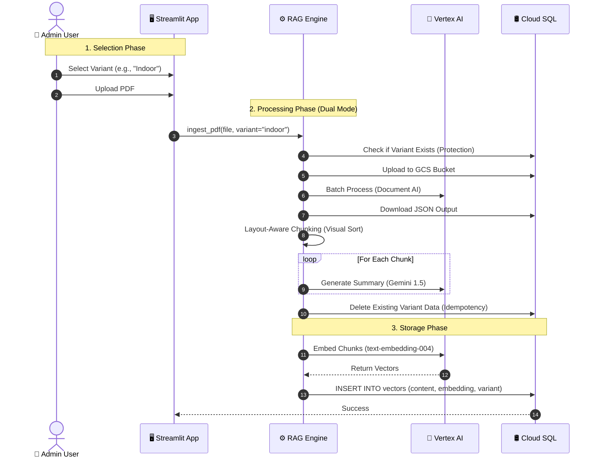
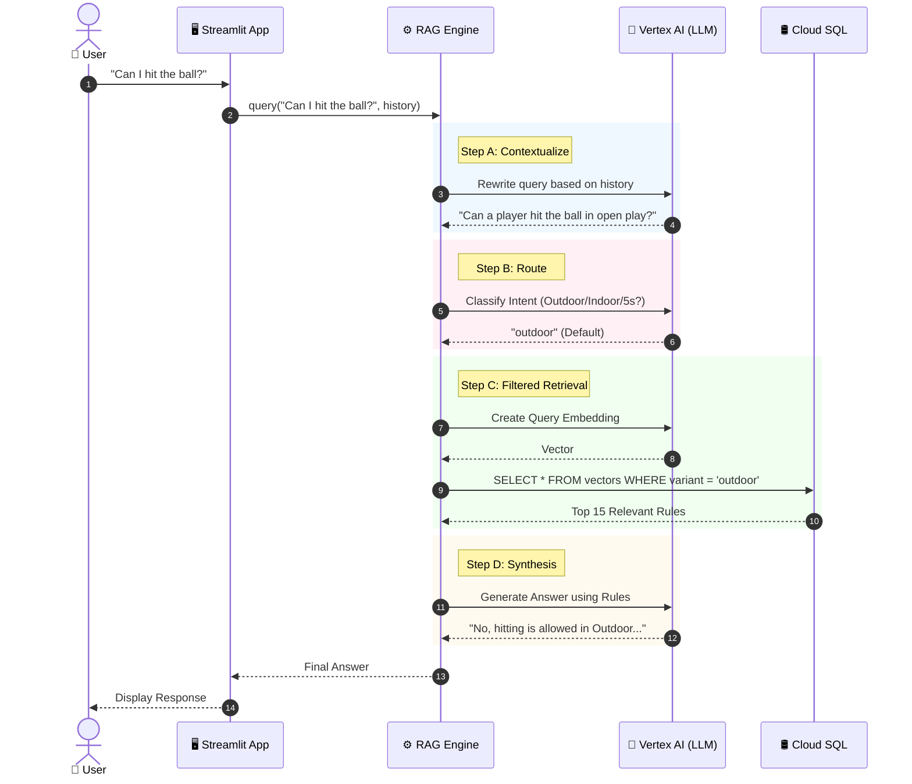

# FIH Rules AI Agent (RAG PoC)

A Cloud-Native Retrieval-Augmented Generation (RAG) system designed to answer complex queries about **International Hockey Federation (FIH) Rules**.

Unlike generic "Chat with PDF" tools, this project implements **domain-specific semantic chunking** and **multi-variant routing** (Outdoor vs. Indoor), ensuring answers are grounded in specific rule citations and the correct context.

---

## Architecture

This project is built on **Google Cloud Platform (GCP)** using a "Raw SQL" approach to bypass ORM limitations.

| Component | Technology | Description |
| :--- | :--- | :--- |
| **Orchestrator** | **LangChain** | Manages the flow between data, logic, and AI. |
| **Ingestion** | **Document AI** | Dual-Mode Layout-Aware Parsing (Online/Batch). |
| **Embeddings** | **Vertex AI** | Uses `text-embedding-004` for vector generation. |
| **Vector DB** | **Cloud SQL** | PostgreSQL 15 + `pgvector`. Accessed via **Raw SQL (`pg8000`)** for maximum control. |
| **Reasoning** | **Gemini 2.0 Flash Lite** | LLM for synthesis and legal reasoning. |
| **Frontend** | **Streamlit** | Interactive web interface with Session State. |
| **Hosting** | **Cloud Run** | Serverless container deployment (1GB RAM). |

### Ingestion flow



### Ingestion Lifecycle Deep Dive

This section details the lifecycle of a document ingestion, explaining how raw PDFs are enriched.

#### Step 1: Selection & Protection
**Goal:** Ensure data integrity and prevent accidental data loss.

*   **Input:** User selects a "Ruleset Variant" (e.g., `Indoor`) and uploads a PDF.
*   **Action:** The system queries the `hockey_rules_vectors` table: `SELECT 1 FROM table WHERE variant = 'indoor'`.
*   **Logic:**
    *   If data exists: **ABORT**. Return warning to user. "Refusing to overwrite."
    *   If empty: Proceed.

#### Step 2: Visual Parsing (Document AI)
**Goal:** Convert a raw PDF into structured, spatially-aware blocks. Generic text extraction (like PyPDF) fails on multi-column layouts.

*   **Component:** **Google Cloud Document AI (OCR Processor)**.
*   **Input:** Raw PDF bytes (via GCS for Batch mode).
*   **AI Operation:** Optical Character Recognition (OCR) + Layout Analysis.
*   **Output:** A `Document` object containing pages, blocks, paragraphs, and—crucially—**spatial coordinates**.

#### Step 3: Layout-Aware Chunking
**Goal:** Reconstruct logical rules from the visual blocks.

*   **Component:** Python Logic (`loaders/document_ai_common.py`).
*   **Logic:**
    1.  **Visual Sort:** Order text blocks by Y-coordinate, then X-coordinate (Row-Major).
    2.  **Regex Segmentation:** Detect Rule headers (e.g., `9.12`) to split text.
    3.  **Hierarchy Extraction:** Detect Chapter titles (ALL CAPS) and Section headers.
    4.  **Metadata Extraction:** Capture **Page Number** and **Source Filename**.

#### Step 4: AI Summarization (Enrichment)
**Goal:** Create a human-readable label for every chunk.

*   **Input:** The raw text of a single chunk.
*   **Component:** **Vertex AI (Gemini 1.5 Flash)**.
*   **AI Operation:** Text Summarization.
*   **Prompt Strategy:**
    ```text
    Summarize this rule in under 15 words.
    TEXT: ...
    ```
*   **Result:** A concise string stored in metadata (e.g., "Penalty Stroke Conditions").

#### Step 5: Embedding & Persistence
**Goal:** Make the enriched text searchable.

*   **Components:** **Vertex AI (`text-embedding-004`)** + **Cloud SQL (pgvector)**.
*   **Action:**
    1.  Convert text content to a 768-dimensional vector.
    2.  Insert row: `[Content, Vector, Variant, Metadata JSON]`.

#### Summary of AI Involvement
| Phase | Model | Purpose |
| :--- | :--- | :--- |
| **Parsing** | **Document AI (OCR)** | **Structure:** extracting layout, columns, and reading order. |
| **Enrichment** | **Gemini 1.5 Flash** | **Summarization:** Creating human-readable labels for chunks. |
| **Storage** | **Text-Embedding-004** | **Searchability:** Converting text to semantic vectors. |

### Query flow




### Query Lifecycle Deep Dive

This section details the lifecycle of a user query, explaining how data is synthesized.

#### Step 1: Input & Contextualization
**Goal:** Handle conversation history (e.g., "What about for a defender?") by turning it into a standalone question.

*   **Input:** User's latest message + Last 4 messages of chat history.
*   **Component:** **Vertex AI (Gemini 2.0 Flash Lite)**.
*   **AI Operation:** Text Rewriting.
*   **Prompt Strategy:**
    ```text
    Rewrite to be standalone.
    HISTORY: ...
    QUESTION: What about for a defender?
    ```
*   **Result (Example):** "What corresponds to a yellow card for a defender in Outdoor hockey?"

#### Step 2: Intent Routing
**Goal:** Determine *which* rulebook to search. Searching "Indoor" rules for an "Outdoor" question leads to hallucinations.

*   **Component:** **Vertex AI (Gemini 2.0 Flash Lite)**.
*   **AI Operation:** Classification.
*   **Result:** A variant string, e.g., `"indoor"`.

#### Step 3: Retrieval (Vector Search)
**Goal:** Find the top 15 most semantically similar rules *within that specific variant*.

*   **Components:** **Vertex AI (`text-embedding-004`)** + **Cloud SQL (pgvector)**.
*   **Query Logic (Raw SQL):**
    ```sql
    SELECT content, variant, metadata
    FROM hockey_rules_vectors
    WHERE variant = :detected_variant  -- <CRITICAL: Hard Filter
    ORDER BY embedding <=> :query_vector
    LIMIT 15
    ```

#### Step 4: Context Assembly
**Goal:** Prepare the data for the LLM with explicit "Hooks" to cite.

*   **Formatting Logic:**
    > `[Rule 9.12] [Source: fih-rules-2023.pdf p.42] (Context: PLAYING > Scoring)`
    > *...rule text content...*

#### Step 5: Synthesis (Final Answer)
**Goal:** Generate a natural language answer grounded *only* in the retrieved context.

*   **Component:** **Vertex AI (Gemini 2.0 Flash Lite)**.
*   **Prompt Structure:**
    ```text
    Expert FIH Umpire for {detected_variant.upper()}.
    Answer based on Context. Cite Rules.

    CONTEXT:
    {formatted_context_with_headers}

    QUESTION:
    {standalone_query}
    ```

#### Summary of AI Involvement
| Phase | Model | Purpose |
| :--- | :--- | :--- |
| **Ingestion** | **Gemini 1.5 Flash** | **Summarization**: Generates human-readable labels for every chunk. |
| **Query** | **Gemini 2.0 Flash Lite** | **Contextualization**: Rewrites follow-up questions. |
| **Query** | **Gemini 2.0 Flash Lite** | **Routing**: Classifies intent (Indoor/Outdoor). |
| **Query** | **Text-Embedding-004** | **Retrieval**: Semantic search. |
| **Query** | **Gemini 2.0 Flash Lite** | **Synthesis**: Final answer generation with citations. |

---

## Project Structure

We follow a modular **MVC + Repository** pattern:

```text
.
├── app.py                 # (View) Streamlit UI & Session State
├── loaders/               # Document Ingestion Strategy Pattern
├── rag_engine.py          # (Controller) Orchestrates AI, Chunking, and Context logic
├── database.py            # (Model/Repository) Raw SQL handling & DB Connections
├── config.py              # Configuration & Constants
├── requirements.txt       # Dependencies
├── Dockerfile             # Container definition
└── docs/                  # Raw PDF Rulebooks
```

---

## Getting Started

### OS Prerequisites (Optional)
**Only required if using legacy local parsing tools** (e.g., Unstructured, PyPDF). If you are using the default Google Cloud Document AI pipeline, you can skip this.

- macOS (Homebrew): `brew install poppler libmagic`
- Debian/Ubuntu: `sudo apt-get update && sudo apt-get install -y poppler-utils libmagic1`

### 1. Prerequisites
* **Python 3.10+** installed locally.
* **Google Cloud CLI (`gcloud`)** installed and authenticated.
* A Google Cloud Project with billing enabled.

### 2. Local Installation
Clone the repository and install dependencies:

```bash
python3 -m venv .venv
source .venv/bin/activate
pip install -r requirements.txt
```

### 2.1 Local Environment (.env)
Create a `.env` file at the repo root to store local credentials and config. The app auto-loads it via `python-dotenv`:

```ini
DB_USER=postgres
DB_PASS=your-strong-password
GCP_PROJECT_ID=your-project-id
GCP_REGION=europe-west1
CLOUDSQL_INSTANCE=fih-rag-db
DOCAI_LOCATION=us
DOCAI_PROCESSOR_ID=your-processor-id
GCS_BUCKET_NAME=your-staging-bucket
```

Run as usual (no extra flags needed): `streamlit run app.py`. The `.env` file is ignored by Git.

Optional developer setup
- Install dev tools: `make dev-install`
- Install Git hooks: `make pre-commit-install`
- Lint/format: `make lint` / `make fmt`

### 3. Infrastructure Setup (One-time)
This project requires a Cloud SQL instance with the `pgvector` extension. Run these commands to provision the infrastructure:

```bash
# Set your project ID
gcloud config set project YOUR_PROJECT_ID

# 1. Enable APIs
gcloud services enable aiplatform.googleapis.com sqladmin.googleapis.com run.googleapis.com

# 2. Create Document AI Processor (OCR)
# This script creates an OCR processor if one doesn't exist.
python scripts/setup_docai_processor.py

# 3. Create Cloud SQL Instance (Micro tier to minimize cost)
gcloud sql instances create fih-rag-db \
    --database-version=POSTGRES_15 \
    --tier=db-f1-micro \
    --region=europe-west1 \
    --root-password=YOUR_STRONG_PASSWORD

# 4. Create Database & Enable IAM
gcloud sql databases create hockey_db --instance=fih-rag-db
gcloud sql instances patch fih-rag-db --database-flags=cloudsql.iam_authentication=on
```

### 4. Running Locally
To run the Streamlit app on your machine (connecting to the Cloud Database):

```bash
# Ensure you are authenticated
gcloud auth application-default login

# Run the app
streamlit run app.py
```

---

## Scripts Overview

Quick utilities to debug and validate parts of the pipeline:

- PDF tools
  - `python scripts/pdf_compare_loaders.py` – Compare PyPDF, PDFPlumber, Unstructured.
  - `python scripts/pdf_ingestion_preview.py` – Preview Unstructured ingestion and confirm LLM connectivity.
  - `python scripts/pdf_chunk_preview.py` – Print rule-aware chunks extracted via PDFPlumber.
- Chroma (local)
  - `python scripts/chroma_debug_search.py` – Inspect similarity search results in a local Chroma DB.
  - `python scripts/chroma_rag_pipeline.py` – Run a full RAG flow using Chroma (no Cloud SQL).
- Cloud SQL (Postgres + pgvector)
  - `python scripts/cloudsql_debug_schema.py` – Inspect table schema vs. library view.
  - `python scripts/cloudsql_rag_pipeline.py` – Run a full RAG flow using Cloud SQL.
  - `python scripts/cloudsql_truncate_table.py` – Danger: truncate the vector table.

All scripts read configuration from `config.py` and `.env`.

Note on large files
- PDFs in `docs/` are tracked via Git LFS going forward. Install LFS with `git lfs install` for optimal cloning/pulling.

---

## Evaluation System (Metric-Driven Development)

We implemented a **Synthetic Evaluation Pipeline** to quantify the performance of the bot before and after making changes. This ensures reliability and allows us to benchmark different architectures (RAG vs Agents).

### Components
1.  **Generator (`evals/generate_dataset.py`)**: Bootstraps a "Golden Dataset" by fetching random chunks from the DB and asking **Gemini** to generate complex QA pairs. It also tracks the `source_text` to measure retrieval performance.
2.  **Judge (`evals/evaluate.py`)**: Runs the dataset against the bot and uses an **LLM-as-a-Judge** (Vertex AI) to grade the answers.
3.  **QA Strategy**: For a deep dive into our testing architecture (Unit Tests, RAGAS, BotEvaluator), see **[TESTING.md](TESTING.md)**.

### Key Metrics
*   **Accuracy:** The percentage of answers graded as "Correct" (Score 1) by the Judge LLM, based on semantic factual agreement with the Ground Truth.
*   **Retrieval Hit Rate:** The percentage of times the *exact source text* used to generate the question appears in the top retrieved documents. High Hit Rate + Low Accuracy = Bad Reasoning. Low Hit Rate = Bad Search.
*   **Rule Citation Rate:** The percentage of answers that explicitly verify their claims by citing the correct Rule Number (e.g., "Rule 9.12") derived from the ground truth context. This enforces "evidence-based" answers.

### Multi-Bot Support
The system uses an **Adapter Pattern** to evaluate different bot implementations using the same dataset.

```bash
# 1. Generate Data (Append to existing)
python evals/generate_dataset.py --limit 10 --variant indoor

# 2. Evaluate default RAG Engine
python evals/evaluate.py --bot rag

# 3. Evaluate a Mock Bot (for testing pipeline)
python evals/evaluate.py --bot mock
```

---

## Deployment (Google Cloud Run)

To deploy the application as a public web service:

**1. Permissions**
Ensure the default Compute Service Account has the required roles:
* `Cloud SQL Client`
* `Vertex AI User`

**2. Deploy Command**
We increase memory to 1GiB to handle the PDF parsing overhead.

```bash
gcloud run deploy fih-rag-app \
    --source . \
    --region europe-west1 \
    --memory 1Gi \
    --allow-unauthenticated \
    --set-env-vars="GCP_PROJECT_ID=YOUR_PROJECT_ID,CLOUDSQL_INSTANCE=fih-rag-db,DB_USER=postgres,DB_PASS=YOUR_DB_PASSWORD"
```

---

## 🧠 Key Engineering Decisions

### 1. Regex-Based Chunking Strategy
Generic text splitters often sever the connection between a Rule Number and its Definition. We implemented a custom chunking logic:
* **Pattern:** `^((Rule\s+)?([1-9]|1[0-9])(\.\d+)+|Rule\s+\d+)$`
* **Effect:** This captures specific rules (e.g., "9.12") while strictly ignoring page numbers (e.g., "36") and merging orphaned headers.

### 2. Conversational Query Reformulation
Raw user queries often lack context (e.g., "What if it was accidental?").
* **Solution:** We implemented a "Query Contextualization" step where an LLM rewrites the user's latest question based on the chat history *before* performing the vector search.

### 3. Modular Architecture (MVC)
We moved from a monolithic script to a separation of concerns:
* **`rag_engine.py` (Controller):** Handles pure Python logic (Database, Vertex AI, Chunking).
* **`loaders/`:** Handles document ingestion strategies:
    * **`UnstructuredLoader`:** Legacy local parser.
    * **`DocumentAILoader`:** Uses Google Cloud Document AI. Implements a "Sharding Strategy" (Split PDF -> Online Process -> Merge) to bypass complexity and GCS permissions.
* **`app.py` (View):** Handles strictly UI rendering and State Management.
* **`config.py`:** Centralizes configuration management.

### 4. High-Recall Retrieval
We utilize a `k=15` retrieval strategy.
* **Why:** Legal queries often require synthesizing multiple rules (e.g., "Definition of Foul" + "Location Penalty").
* **How:** We leverage Gemini 2.0 Flash Lite's context window to retrieve a wider net of potential rules, allowing the LLM to filter noise and perform multi-hop reasoning.

### 5. Document AI "Dual Mode" Strategy
To balance **Ease of Use** vs **Semantic Completeness**, we implemented a Factory Pattern supporting two modes:
*   **Online Mode (Default):** Client-side sharding (15 pages/req). Fast, zero infrastructure setup, bypasses IAM.
*   **Batch Mode:** Full GCS uploads. Slower but preserves cross-page context.
*   **Shared Intelligence:** Both modes use the same `DocumentAILayoutMixin` to perform **Visual Sorting** (Row-Major), ensuring columns are read correctly.

### 6. Overwrite Protection (Safety First)
Accidental re-ingestion could disrupt the knowledge base.
*   **Protection:** The system checks if data for a variant (e.g., "Indoor") already exists before processing.
*   **Refusal:** If found, it refuses the upload with a warning, requiring administrative action to clear the database first. This prevents accidental data loss or duplication.

### 7. Metadata-Driven Context Injection
To prevent the LLM from hallucinating constraints, we implemented a **Hierarchical Metadata Strategy**.
*   **Extraction:** Detects Chapters (ALL CAPS) and Sections (Digit + Text).
*   **Source Attribution:** Tracks **Original Filename** and **Page Numbers** for every chunk, ensuring citations are precise (e.g., `rules.pdf p.42`).
*   **Injection:** During retrieval, context is formatted to explicitly cite the source: `[Rule 9.12] [Source: rules.pdf p.42] (Context: PLAYING > Scoring)`.

### 8. AI-Generated Summaries
We enrich each chunk with a **concise, AI-generated summary** (max 15 words) during ingestion. This "human-readable label" (e.g., "Umpires must remain neutral") allows the system to present search results that are immediately understandable to users, rather than just listing opaque rule numbers like "1.2".
### 9. UX Enhancements
*   **Starter Questions:** Proactive suggestions (e.g., "Duration of Yellow Card") help users discover capabilities immediately.
*   **Persistent Debug Inspector:** A dedicated, persistent view displays the routing logic, query reformulation, and source metadata (including summaries) for the last query, ensuring transparency without cluttering the chat.

