# 🏑 FIH Rules AI Agent (RAG PoC)

A Cloud-Native Retrieval-Augmented Generation (RAG) system designed to answer complex queries about **International Hockey Federation (FIH) Rules**.

Unlike generic "Chat with PDF" tools, this project implements **domain-specific semantic chunking** and **multi-variant routing** (Outdoor vs. Indoor), ensuring answers are grounded in specific rule citations and the correct context.

---

## 🏗 Architecture

This project is built on **Google Cloud Platform (GCP)** using a "Raw SQL" approach to bypass ORM limitations.

| Component | Technology | Description |
| :--- | :--- | :--- |
| **Orchestrator** | **LangChain** | Manages the flow between data, logic, and AI. |
| **Ingestion** | **Unstructured.io** | Layout-aware PDF parsing (detects headers vs. content). |
| **Embeddings** | **Vertex AI** | Uses `text-embedding-004` for vector generation. |
| **Vector DB** | **Cloud SQL** | PostgreSQL 15 + `pgvector`. Accessed via **Raw SQL (`pg8000`)** for maximum control. |
| **Reasoning** | **Gemini 1.5 Flash** | LLM for synthesis and legal reasoning. |
| **Frontend** | **Streamlit** | Interactive web interface with Session State. |
| **Hosting** | **Cloud Run** | Serverless container deployment (1GB RAM). |

### Ingestion flow

```mermaid
sequenceDiagram
    autonumber
    actor User as 👤 Admin User
    participant App as 🖥️ Streamlit App
    participant Engine as ⚙️ RAG Engine
    participant Vertex as 🧠 Vertex AI
    participant DB as 🛢️ Cloud SQL

    Note over User, App: 1. Selection Phase
    User->>App: Select Variant (e.g., "Indoor")
    User->>App: Upload PDF

    Note over Engine: 2. Processing Phase
    App->>Engine: ingest_pdf(file, variant="indoor")
    Engine->>Engine: Parse PDF (PDFPlumber)
    Engine->>Engine: Semantic Chunking (Regex)

    Note over Engine, DB: 3. Storage Phase
    Engine->>Vertex: Embed Chunks (text-embedding-004)
    Vertex-->>Engine: Return Vectors
    Engine->>DB: INSERT INTO vectors (content, embedding, variant)
    DB-->>App: Success
```


### Query flow

```mermaid
sequenceDiagram
    autonumber
    actor User as 🙋 User
    participant App as 🖥️ Streamlit App
    participant Engine as ⚙️ RAG Engine
    participant Vertex as 🧠 Vertex AI (LLM)
    participant DB as 🛢️ Cloud SQL

    User->>App: "Can I hit the ball?"
    App->>Engine: query("Can I hit the ball?", history)

    rect rgb(240, 248, 255)
        Note right of Engine: Step A: Contextualize
        Engine->>Vertex: Rewrite query based on history
        Vertex-->>Engine: "Can a player hit the ball in open play?"
    end

    rect rgb(255, 240, 245)
        Note right of Engine: Step B: Route
        Engine->>Vertex: Classify Intent (Outdoor/Indoor/5s?)
        Vertex-->>Engine: "outdoor" (Default)
    end

    rect rgb(240, 255, 240)
        Note right of Engine: Step C: Filtered Retrieval
        Engine->>Vertex: Create Query Embedding
        Vertex-->>Engine: Vector
        Engine->>DB: SELECT * FROM vectors WHERE variant = 'outdoor'
        DB-->>Engine: Top 15 Relevant Rules
    end

    rect rgb(255, 250, 240)
        Note right of Engine: Step D: Synthesis
        Engine->>Vertex: Generate Answer using Rules
        Vertex-->>Engine: "No, hitting is allowed in Outdoor..."
    end

    Engine-->>App: Final Answer
    App-->>User: Display Response

```




---

## 📂 Project Structure

We follow a modular **MVC + Repository** pattern:

```text
.
├── app.py                 # (View) Streamlit UI & Session State
├── rag_engine.py          # (Controller) Orchestrates AI, Chunking, and Context logic
├── database.py            # (Model/Repository) Raw SQL handling & DB Connections
├── config.py              # Configuration & Constants
├── requirements.txt       # Dependencies
├── Dockerfile             # Container definition
└── docs/                  # Raw PDF Rulebooks
```

---

## 🚀 Getting Started

### 1. Prerequisites
* **Python 3.10+** installed locally.
* **Google Cloud CLI (`gcloud`)** installed and authenticated.
* A Google Cloud Project with billing enabled.

### 2. Local Installation
Clone the repository and install dependencies:

```bash
python3 -m venv .venv
source .venv/bin/activate
pip install -r requirements.txt
```

### 2.1 Local Environment (.env)
Create a `.env` file at the repo root to store local credentials and config. The app auto-loads it via `python-dotenv`:

```ini
DB_USER=postgres
DB_PASS=your-strong-password
GCP_PROJECT_ID=your-project-id
GCP_REGION=europe-west1
CLOUDSQL_INSTANCE=fih-rag-db
```

Run as usual (no extra flags needed): `streamlit run app.py` or `python scripts/debug_schema.py`. The `.env` file is ignored by Git.

### 3. Infrastructure Setup (One-time)
This project requires a Cloud SQL instance with the `pgvector` extension. Run these commands to provision the infrastructure:

```bash
# Set your project ID
gcloud config set project YOUR_PROJECT_ID

# 1. Enable APIs
gcloud services enable aiplatform.googleapis.com sqladmin.googleapis.com run.googleapis.com

# 2. Create Cloud SQL Instance (Micro tier to minimize cost)
gcloud sql instances create fih-rag-db \
    --database-version=POSTGRES_15 \
    --tier=db-f1-micro \
    --region=europe-west1 \
    --root-password=YOUR_STRONG_PASSWORD

# 2. Create Database & Enable IAM
gcloud sql databases create hockey_db --instance=fih-rag-db
gcloud sql instances patch fih-rag-db --database-flags=cloudsql.iam_authentication=on
```

### 4. Running Locally
To run the Streamlit app on your machine (connecting to the Cloud Database):

```bash
# Ensure you are authenticated
gcloud auth application-default login

# Run the app
streamlit run app.py
```

---

## ☁️ Deployment (Google Cloud Run)

To deploy the application as a public web service:

**1. Permissions**
Ensure the default Compute Service Account has the required roles:
* `Cloud SQL Client`
* `Vertex AI User`

**2. Deploy Command**
We increase memory to 1GiB to handle the PDF parsing overhead.

```bash
gcloud run deploy fih-rag-app \
    --source . \
    --region europe-west1 \
    --memory 1Gi \
    --allow-unauthenticated \
    --set-env-vars="GCP_PROJECT_ID=YOUR_PROJECT_ID,CLOUDSQL_INSTANCE=fih-rag-db,DB_USER=postgres,DB_PASS=YOUR_DB_PASSWORD"
```

---

## 🧠 Key Engineering Decisions

### 1. Regex-Based Chunking Strategy
Generic text splitters often sever the connection between a Rule Number and its Definition. We implemented a custom chunking logic:
* **Pattern:** `^((Rule\s+)?([1-9]|1[0-9])(\.\d+)+|Rule\s+\d+)$`
* **Effect:** This captures specific rules (e.g., "9.12") while strictly ignoring page numbers (e.g., "36") and merging orphaned headers.

### 2. Conversational Query Reformulation
Raw user queries often lack context (e.g., "What if it was accidental?").
* **Solution:** We implemented a "Query Contextualization" step where an LLM rewrites the user's latest question based on the chat history *before* performing the vector search.

### 3. Modular Architecture (MVC)
We moved from a monolithic script to a separation of concerns:
* **`rag_engine.py` (Controller):** Handles pure Python logic (Database, Vertex AI, Chunking).
* **`app.py` (View):** Handles strictly UI rendering and State Management.
* **`config.py`:** Centralizes configuration management.

### 4. High-Recall Retrieval
We utilize a `k=15` retrieval strategy.
* **Why:** Legal queries often require synthesizing multiple rules (e.g., "Definition of Foul" + "Location Penalty").
* **How:** We leverage Gemini 1.5's massive context window to retrieve a wider net of potential rules, allowing the LLM to filter noise and perform multi-hop reasoning.
