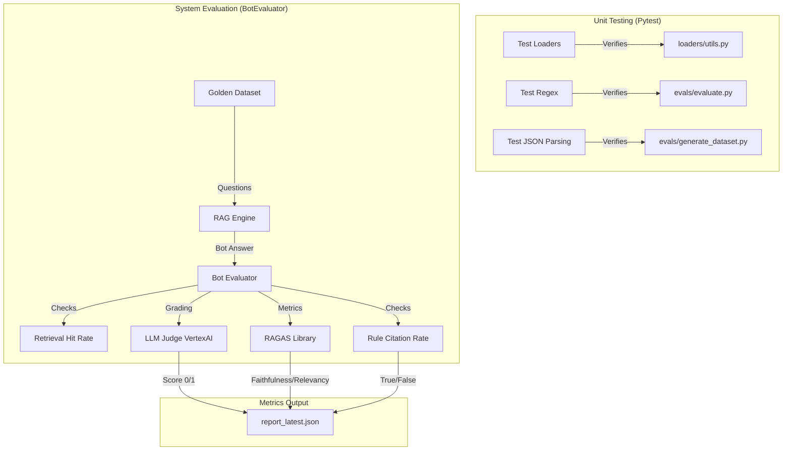

# QA & Evaluation Strategy

This document outlines the multi-layered Quality Assurance strategy implemented for the FIH Rules RAG application. We employ a pyramid testing approach, ranging from low-level unit verification to high-level semantic evaluation using AI judges.

## 1. Testing Architecture

The following diagram illustrates how we verify the system at different stages:



## 2. Unit Testing Layer
We use `pytest` to verify the deterministic logic components of the system. This ensures that utility functions fail gracefully and behave as expected before we even involve the LLM.

| Component | Test File | Description |
|-----------|-----------|-------------|
| **Summarization** | `tests/test_loaders_utils.py` | Verifies `summarize_text` handles empty inputs, `None` values, and API errors without crashing. |
| **Logic & Regex** | `tests/test_evaluation_logic.py` | Tests the `_check_citation` method to ensure it correctly extracts and matches rule numbers (e.g., "Rule 9.12" vs "9.12"). |
| **Dataset Gen** | `tests/test_dataset_generation.py` | Verifies that the JSON parser correctly strips markdown code blocks from LLM responses. |

**Command to run:**
```bash
./.venv/bin/pytest tests/
```

## 3. System Evaluation (LLM-as-a-Judge)
For semantic correctness, we cannot rely on simple unit tests. We use an **LLM-as-a-Judge** approach where a secondary LLM evaluates the answers generated by the RAG system against a "Golden Dataset".

### Core Components
*   **Golden Dataset** (`evals/generated_dataset.json`): A curated list of question/answer pairs generated from the source text.
*   **BotEvaluator** (`evals/evaluate.py`): The main engine that runs the evaluation loop.

### Custom Metrics
These metrics are calculated directly by our `BotEvaluator`:

1.  **Correctness (Accuracy)**: An LLM prompts compares the `Bot Answer` vs `Ground Truth`.
    *   *Score*: 0 (Incorrect) or 1 (Correct).
    *   *Criteria*: Does the answer coincide with the ground truth facts?
2.  **Retrieval Hit Rate**: Checks if the *exact* source chunk used to generate the question was present in the retrieved documents.
3.  **Rule Citation Rate**: Uses Regex to verify if the bot cited the specific rule number (e.g., "(Rule 9.12)") that was present in the source metadata.

## 4. RAGAS Integration
We utilize the **RAGAS** (Retrieval Augmented Generation Assessment) library to provide industry-standard metrics for our RAG pipeline.

| Metric | Definition | Goal |
|--------|------------|------|
| **Faithfulness** | Measures if the answer is purely derived from the retrieved context. | Avoid Hallucinations. High score = Answer is supported by text. |
| **Answer Relevancy** | Measures how relevant the answer is to the question. | Avoid rambling. High score = Direct answer. |
| **Context Precision** | Measures if the relevant chunks are ranked higher in the results. | High score = Best rules found first. |
| **Context Recall** | Measures if the retrieved context contains the answer to the question. | High score = We retrieved the right info. |

## 5. Execution Flow
1.  **Generate Dataset (Optional)**: `python evals/generate_dataset.py` creates new QA pairs from the vector DB.
2.  **Run Evaluation**: `python evals/evaluate.py` runs the RAG bot against the dataset.
3.  **View Results**:
    *   **Console**: Live progress bar and summary stats.
    *   **JSON Report**: `evals/report_latest.json` contains full details.
    *   **Dashboard**: `pages/1_Evaluation_Dashboard.py` visualizes the results in the web app.
